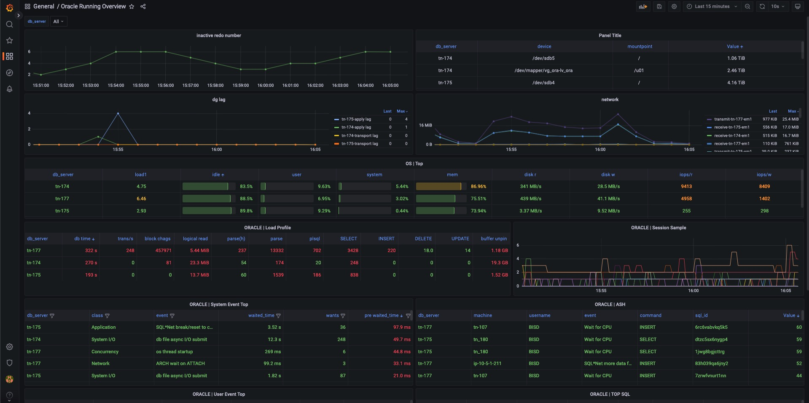

### Usage
```sh
curl -g 'http://127.0.0.1:9521/metrics?collect[]=sql&dsn=10.65.193.14:1521/func1'
go env -w GO111MODULE=on
go env -w GOPROXY=https://goproxy.cn,direct
go run main.go mdb.go mp.go --mdb.addr=mdb:5000 --file.metrics http://gitlab.wexfin.com/oradba/prom-oracle/raw/master/metrics-11g.yaml
```

### dashboard
